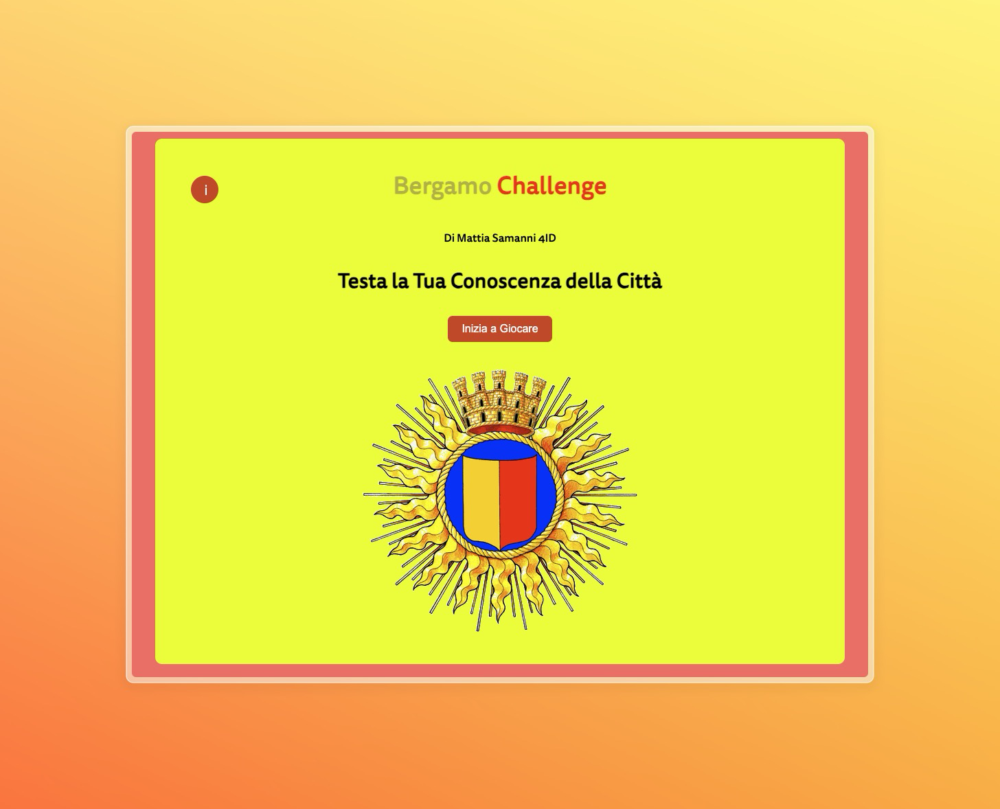
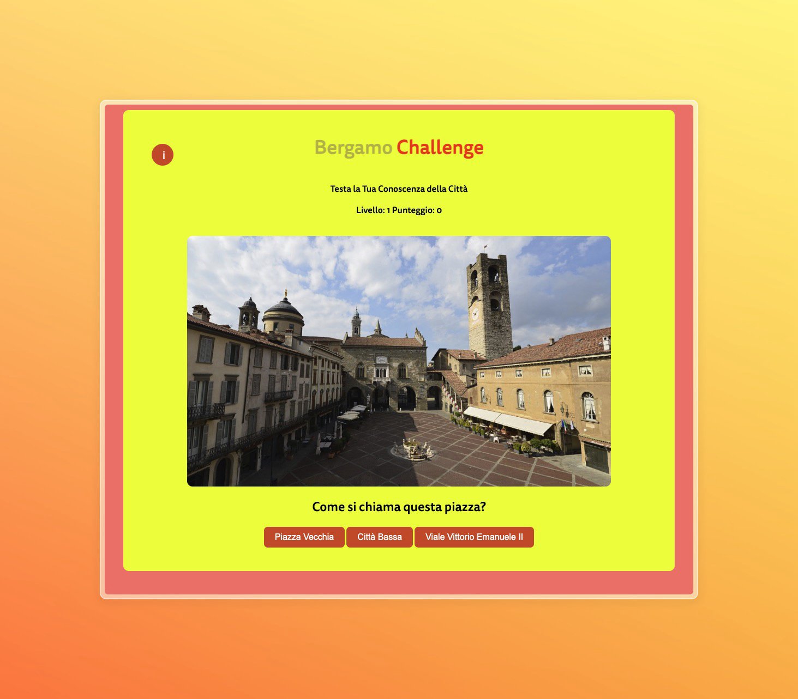

# Bergamo Challenge

**Bergamo Challenge** is an interactive quiz game that tests your knowledge of the picturesque city of Bergamo (Italy).  
You’ll see a series of images showing iconic places in Bergamo and you must pick the correct answer from **three** options.

> School project developed for **ABCDigital** (http://www.abc-digital.org/), held in Bergamo during the **2023–2024** school year.

---

## Gameplay rules

- Each question shows:
  - 1 image of a place in Bergamo
  - 3 possible answers
- Scoring:
  - Correct answer: **+2 points** and you advance to the next level
  - Wrong answer: **-1 point**
- Losing condition:
  - If your score becomes **negative**, you lose.

---

## Screenshots

### Main page


### Question example


### Win page


---

## Getting started

1. Clone the repository
   ```bash
   gh repo clone Smatjoy/Bergamo-Challenge
2. Open ```index.html``` file
